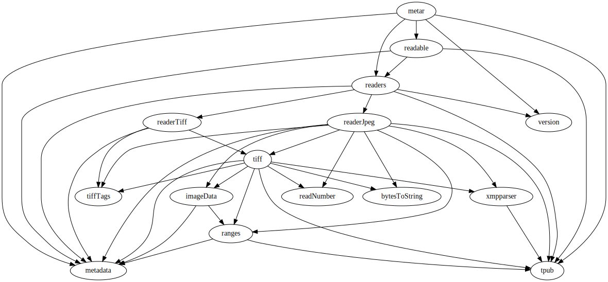

=================
Metar
=================

Metar is a library and command line program for reading image metadata.

You can read metadata from JPEG, DNG and TIFF images. Metar
understands the standard image metadata formats: XMP, IPTC, Exif,
and Tiff tags.

* `How to Run Metar`_
* `How Use Metar in Python Programs`_
* `More Pages`_

How to Run Metar
=================

You can run metar from the command line to display image
metadata. Running metar without any parameters shows how to use
it.  For example::

  metar

  Show metadata information for the given image(s).
  Usage: metar [-j] [-v] file [file...]
  -j --json     Output JSON data.
  -v --version  Show the version number.
  -h --help     Show this help.
  file          Image filename to analyze.

You pass an image filename and metar outputs metadata to the
screen, for example::

  metar testfiles/image.dng

  ========== ifd1 ==========
  offset = 8
  next = 0
  NewSubfileType(254) = [1]
  ImageWidth(256) = [256]
  ImageHeight(257) = [171]
  BitsPerSample(258) = [8, 8, 8]
  Compression(259) = [1]
  PhotometricInterpretation(262) = [2]
  Make(271) = ["Canon"]
  Model(272) = ["Canon EOS 20D"]
  ...

Only the first few lines are shown in the example above to save
space.  For this image there are 291 lines::

  metar testfiles/image.dng | wc -l
  291

How Use Metar in Python Programs
=================

You can use the metar python module to read image file metadata
in your python programs. It contains four public methods:
read_metadata_json, read_metadata, key_name, and get_version.

In a python interactive session you can see the methods::

  >>> import metar
  >>> dir(metar)

  ['__doc__', '__file__', '__name__', '__package__',
  'get_version', 'key_name', 'read_metadata', 'read_metadata_json']

The metar module has help documentation in doc strings.

::

  >>> help(metar)

You can determine the metar version number with the get_version
function:

::

  >>> metar.get_version()
  '0.0.4'

You can read the metadata from jpeg and tiff image files using
the read_metadata and read_metadata_json functions.

The read_metadata_json function returns the metadata as a JSON
string. You can load that into a python dictionary with the json
loads function.

::

  >>> filename = "testfiles/IMG_6093.JPG"
  >>> string = metar.read_metadata_json(filename)
  >>> import json
  >>> metadata = json.loads(string)

Then you can extract the metadata you are interested in from the
dictionary.

::

  >>> image = metadata['image']
  >>> print('width = %s' % image['width'])
  width = 3329
  >>> print('height = %s' % image['height'])
  height = 2219

The read_metadata function returns a more human readable string.

::

  >>> string = metar.read_metadata(filename)
  >>> print(string)
  ========== APP0 ==========
  id = "JFIF"
  major = 1
  minor = 2
  units = 1
  x = 240
  y = 240
  ...

More Pages
=================

You can learn how to build, test and install on the development page.

* `development <docs/project.rst>`_ -- how to build, test and install

You can learn how metar deals with special images with unknown
sections or corrupt files and other details on the details page.

* `details <docs/main.rst>`_ -- metadata processing details

You can view the documentation for all the modules and procedures on the index
page. This documentation is created from embedded doc comments in
the source.

* `index <docs/html/theindex.html>`_ -- index to source documentation

Here is the metar module dependencies graph:

